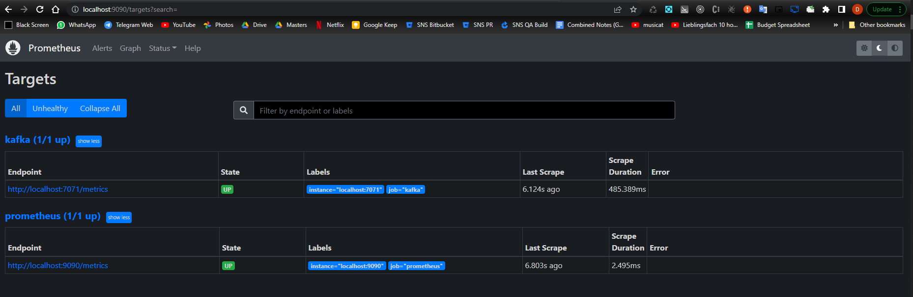
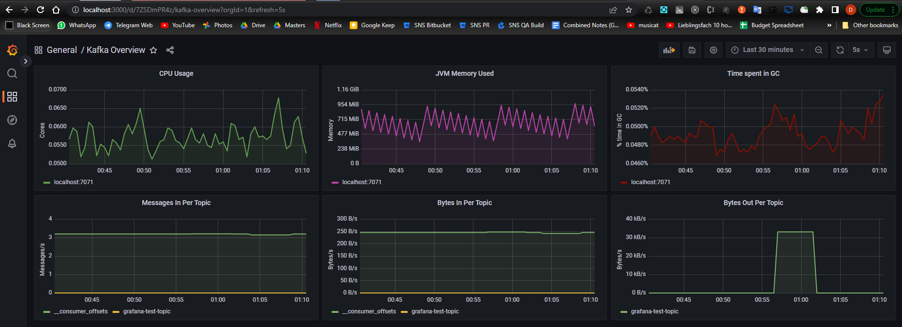

### Zookeeper

- Download [Zookeeper](https://zookeeper.apache.org/releases.html)
- Run Zookeeper with `zkserver`

### Kafka

- Download [Kafka Server](https://kafka.apache.org/downloads)
- **Note: Kafka scripts are in `path\to\kafkainstallation\bin`* if path is not set
- Download the [JMX Exporter for Prometheus JAR](https://repo1.maven.org/maven2/io/prometheus/jmx/jmx_prometheus_javaagent/) , latest version [here](https://repo1.maven.org/maven2/io/prometheus/jmx/jmx_prometheus_javaagent/0.17.0/jmx_prometheus_javaagent-0.17.0.jar)
- Download a sample [JMX Exporter config file](https://raw.githubusercontent.com/prometheus/jmx_exporter/master/example_configs/kafka-0-8-2.yml) i.e. `kafka-0-8-2.yml`
- Configure `KAFKA_OPTS` environment variable in terminal prior to running Kafka Server, to run JMX Exporter as a Java agent when starting Kafka server
  - Referencing the two files above, for e.g. in Windows powershell, `$env:KAFKA_OPTS = "$KAFKA_OPTS -javaagent:jmx_prometheus_javaagent-0.6.jar=7071:kafka-0-8-2.yml"` (or specify full path if running from another location)
- Run Kafka Server with `kafka-server-start.bat path\to\kafkainstallation\config\server.properties`
- Create topic via CLI `kafka-topics.bat --bootstrap-server localhost:9092 --create --replication-factor 1 --partitions 16 --topic=grafana-test-topic`

### Backend Application

- Make sure you hava Java (8 or 11) JDK set up
- Install [sbt](https://www.scala-sbt.org/download.html) to manage dependencies
- If using Intellij, create [`Play 2 App` run configuration](https://www.jetbrains.com/help/idea/getting-started-with-play-2-x.html#run_debug_play)
- Use run configuration to start the app after sbt project and dependencies are set up
- Both Kafka producer and consumer are running on the same application
  - To run the consumer as a separate application:
    - Create two separate run configurations for producer and consumer application
    - Override `KAFKA_CONSUMER_ENABLED` environment variable in producer run configuration as `false` (defaults to `true`)
- Test endpoint
  - See `app/controllers/HomeController.java` for entry point
  - Endpoint expects `{"message": <some-text>}`, publishes `<some-text>` on the producer and consumer logs `<some-text>` to console
  ```
  curl --location --request POST 'http://localhost:9000/publish-kafka-message' \
    --header 'Content-Type: application/json' \
    --data-raw '{
    "message": "test hello"
    }'
  ```
- Additional command to view topic contents while using endpoint with app running: `kafka-console-consumer.bat --topic grafana-test-topic --from-beginning --bootstrap-server localhost:9092`

### Prometheus

Scraper/monitoring system for Kafka Server metrics.

- Download [Prometheus](https://prometheus.io/download/)
- Modify config file `path\to\download\prometheus.yml`
  - Reduce `scrape_interval` and `evaluation_interval` to `5-10s`
  - Add code under `scrape_configs` (take note of indentation)
    ```
    scrape_configs:
    //...
      - job_name: 'kafka'
      static_configs:
        - targets:
        - localhost:7071
    ```
- Run the executable `path\to\download\prometheus.exe`
- Access `http://localhost:9090/targets?search=` and make sure both Kafka metrics target is up

### Grafana

UI component for visualizing metrics.

- Download [Grafana](https://grafana.com/grafana/download)
- Run the executable in `path\to\installation\GrafanaLabs\grafana\bin`
- Access `http://localhost:3000/` and login with `admin/admin`
- Add Prometheus data source
  - Click on the Grafana logo to open the sidebar menu.
  - Click on `Configuration --> Data sources` and then add new data source
  - Select `Prometheus` as type
  - Select the Prometheus server URL (http://localhost:9090/)
  - Click `Save & test`
- Create default Kafka overview dashboard
    - Download [Kafka sample dashboard](https://grafana.com/dashboards/721) as a JSON file
    - From Grafana sidebar, click on `Dashboards --> Library panels --> + Import`
    - Follow instructions to upload downloaded JSON file and click `Load`
    - Dashboard will now be visible under `Dashboards --> Browse`

### Locust

- Install [Locust](https://docs.locust.io/en/stable/installation.html)
- Create `locustfile.py` with
  ```
  from locust import HttpUser, task
  import uuid
    
  class HelloWorldUser(HttpUser):
    @task
    def hello_world(self):
      self.client.post("/publish-kafka-message", json={"message": str(uuid.uuid4())})
  ```
- Access `http://localhost:8089/` and start swarmin'

### Results


